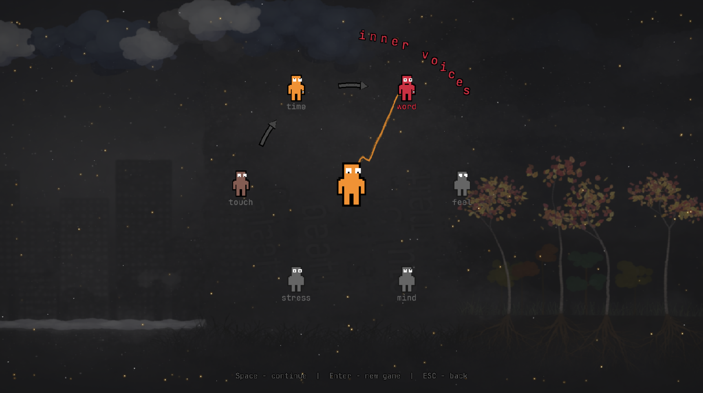
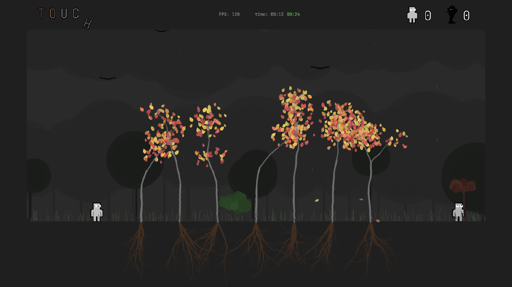
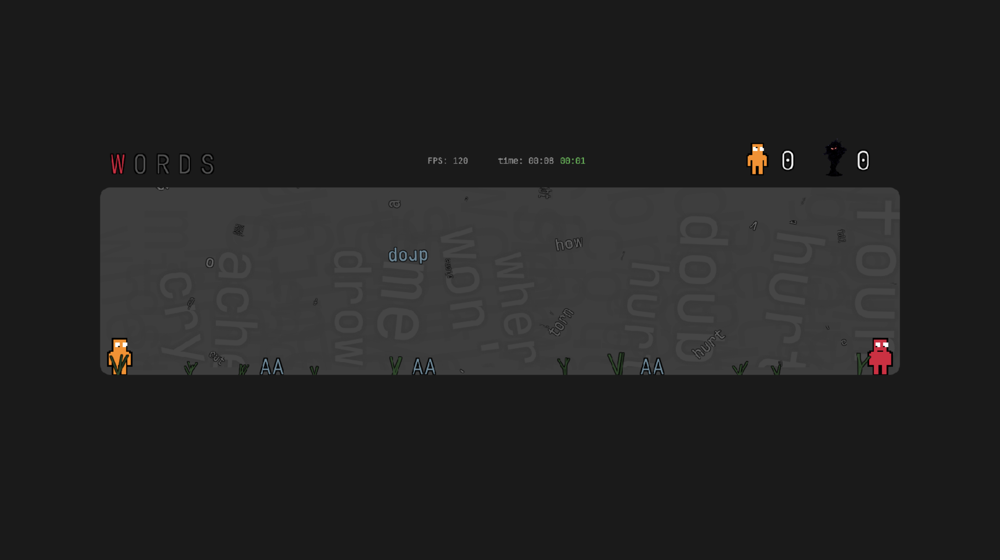

# Find Yourself

A philosophical 2D platformer about self-discovery through life's challenges. Navigate through different aspects of existence while searching for yourself.

**[Play online](https://find-myself.netlify.app/)**







## About the Game

**Find Yourself** is a minimalist platformer where you journey through abstract worlds representing different forces that shape who you are. Each world presents unique challenges and obstacles that mirror real struggles in life — from cutting words to the relentless passage of time.

Your goal is to find another "you" — a reflection shaped by the very forces you're learning to face. Reaching them means meeting yourself honestly and understanding yourself a little more.

Life will confuse you. You will fall. But each fall brings you closer to who you truly are.

## Created with AI

This game was **entirely created with the help of an AI agent** (Claude by Anthropic). From the initial concept to the final implementation, every line of code, game mechanic, visual effect, and procedural sound was developed through collaborative AI-assisted programming.

**The creative process:**
- **Human**: Provides vision, ideas, game design decisions, and creative direction
- **AI**: Implements the ideas, writes code, creates systems, and solves technical challenges

The project demonstrates the potential of AI-augmented game development, where human creativity meets AI capabilities to build a complete, playable experience.

## Sections

The game is divided into 6 sections, each with its own theme, atmosphere, and mechanics. Three sections are currently playable. The player must complete them in order to progress.

- **Touch** — "before words… touch"
- **Time** — "time doesn't wait"
- **Word** — "words like blades"
- **Feel** — coming soon
- **Mind** — coming soon
- **Stress** — coming soon

## Design Philosophy

**Find Yourself** is designed around several core principles:

1. **Minimalism**: Clean, focused design without unnecessary elements
2. **Procedural Generation**: Everything is created through code — no external sprite sheets or image assets
3. **Meaningful Challenge**: Each obstacle represents a real-life concept
4. **Self-Discovery**: The journey is about understanding yourself through overcoming challenges
5. **Atmosphere Over Graphics**: Mood and feeling take priority over visual complexity

## Core Mechanics

### Movement
- **Arrow Keys / WASD**: Move left and right
- **Space / W / Up Arrow**: Jump
- **ESC**: Return to menu
- **Mouse**: Hover over objects for tooltip hints

### Dual Character System
- Control the **Hero** (colored character)
- Seek the **Anti-Hero** (dark reflection)
- Upon meeting, both characters annihilate in a particle explosion
- Meeting your reflection advances to the next challenge

### Tooltip System
- Hover over any game object to discover hints and lore
- Monsters, bugs, heroes, and UI elements all have unique messages
- Some tooltips are timed — appearing only after the player struggles

### Death & Respawn
- Contact with hazards causes the hero to disintegrate into particles
- Instant respawn at the start of the level
- Life score tracks how many times you've fallen

### Speed Bonus
- Each level has a target completion time (shown as green timer)
- Complete a level within the target to earn bonus points
- Flash and particle effects celebrate fast completions

### Progress Tracking
- Game automatically saves progress in browser localStorage
- Continue from where you left off
- Section completion unlocks the next section in the menu

## Technical Details

### Built With
- [Kaplay.js](https://kaplayjs.com/) — Game engine (canvas rendering, physics, scene management)
- Vanilla JavaScript (ES6+ modules)
- Web Audio API for procedural sound synthesis
- HTML5 Canvas for sprite generation and background baking
- Vite for development and building

## Development

### Prerequisites
- Node.js (v14 or higher)
- npm or yarn

### Setup
```sh
# Install dependencies
npm install

# Start development server
npm run dev
```

Development server will start at http://localhost:8000

### Building
```sh
# Build for production
npm run build

# Build and create zip package
npm run zip
```

Built files will be in the `dist/` folder.

## License

This project is licensed under the MIT License - see the [LICENSE](LICENSE) file for details.

---

*Life is the one setting traps. It shifts the ground, twists logic, and pushes you into mistakes — not to harm you, but to teach you.*
