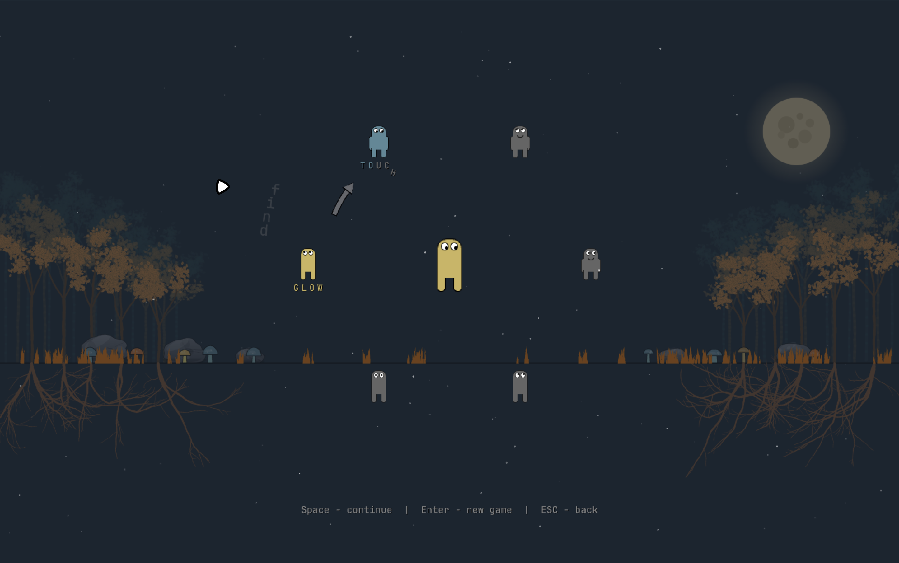
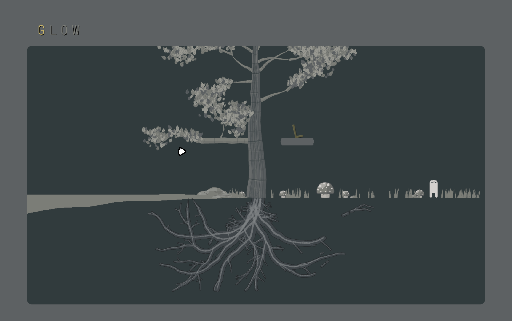
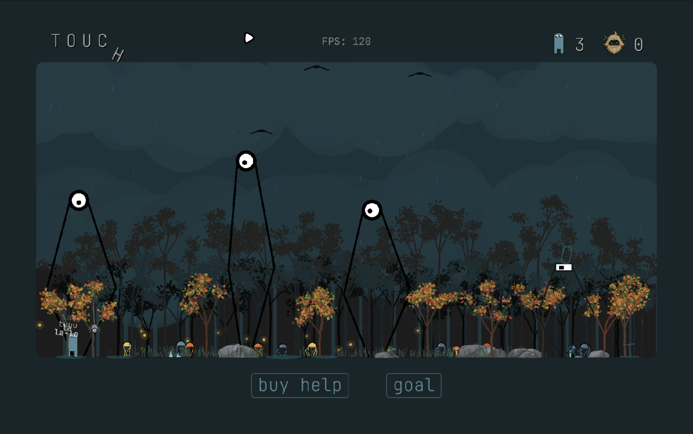
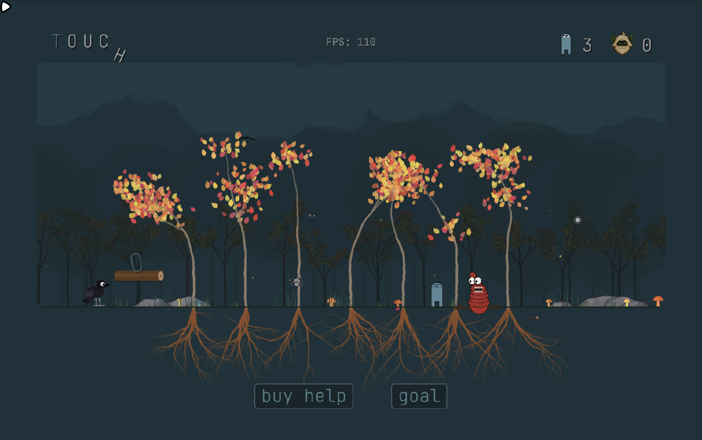

# Find Yourself

A philosophical hi-bit pixel-art platformer about perception, self-discovery, and growing through interaction with the world.

**[Play online](https://find-myself.netlify.app/)**









## Description

**Find Yourself** is a narrative 2D platformer where gameplay is built around psychological growth instead of traditional progression.

Rather than collecting coins or unlocking weapons, the player discovers words, emotions, senses and ways of perceiving the world. Every level represents a small step of self-development, and every mechanic is designed to symbolize an internal change.

---

## Philosophy

The game asks a simple question:

> **What if a platformer could teach you to understand yourself instead of simply challenging your reflexes?**

Every section explores one aspect of human development.

Instead of telling the player what to think, the game lets them experience ideas through interaction.

Examples include:

* learning to notice details instead of rushing;
* understanding that the world is full of shades rather than only black and white;
* curiosity instead of certainty;
* touch before words;
* perception before understanding.

There are no explicit lessons.

The player discovers everything naturally.

---

## Gameplay

The gameplay combines exploration, environmental puzzles and classic platforming.

Each level revolves around collecting the letters of a single meaningful word.

The word itself becomes the mechanic.

Examples:

* **GLOW** — discovering curiosity and perception.
* **TOUCH** — learning connection through interaction with the environment.
* Future sections introduce new concepts in the same way.

Collecting every letter changes the world around the player.

Colors appear.

Objects become interactive.

Sounds emerge.

New mechanics become available.

The world evolves together with the player.

---

## Psychological design

Every level is built around four questions:

1. What psychological skill is being developed?
2. What gameplay action symbolizes it?
3. What discovery does the player make?
4. What should remain with them after the level?

The goal is not to explain psychology.

The goal is to let players *feel* it.

---

## World

The world begins almost empty.

As curiosity grows, the player slowly discovers:

* colors;
* sounds;
* emotions;
* relationships;
* language;
* time.

The environment becomes richer together with the player's perception.

---

## Core principles

* Meaning before mechanics.
* Discovery before explanation.
* Show instead of tell.
* Every mechanic should symbolize an internal change.
* Minimal UI.
* Calm atmosphere.
* No unnecessary dialogue.
* Every level leaves the player with one small thought to carry into real life.

---

## Technology

The project is built with:

* JavaScript
* Kaplay.js
* HTML5 Canvas
* Vite

Everything is handcrafted, including the gameplay systems, shaders, particles, procedural sounds and visual effects.

---

## Current status

The game is currently in active development.

The first playable section focuses on **GLOW**, introducing curiosity, observation and perception through exploration.

Many mechanics are experimental and continue to evolve as the core philosophy of the project becomes more refined.

---

## Development

### Prerequisites
- Node.js (v14 or higher)
- npm or yarn

### Setup
```sh
# Install dependencies
npm install

# Start development server
npm run dev
```

Development server will start at http://localhost:3001

### Building
```sh
# Build for production
npm run build

# Build and create zip package
npm run zip

# Build binary for the current OS
npm run bin
```

Built files will be in the `dist/` folder.

## License

This project is licensed under the MIT License - see the [LICENSE](LICENSE) file for details.

---

*Sometimes understanding yourself begins with simply noticing what has always been there.*
